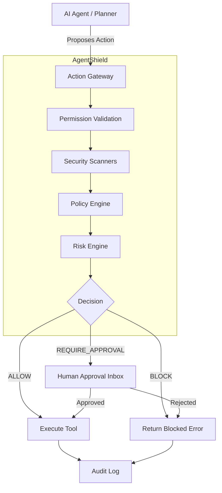

# System Architecture

## Overview
AgentShield uses a gateway pattern to intercept and evaluate all agent actions.

## Components
- **Action Gateway**: The core evaluation pipeline.
- **Risk Engine**: Calculates a 0-100 score based on parameters.
- **Policy Engine**: Evaluates rule-based constraints.
- **Security Scanners**: Detects API keys, PII, and prompt injection patterns.
